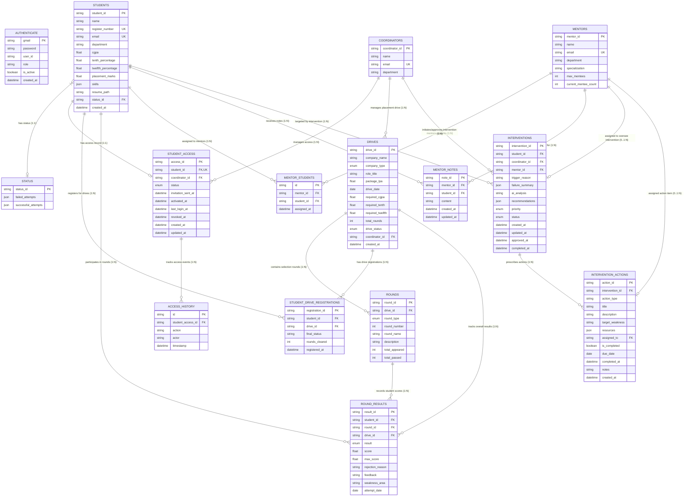
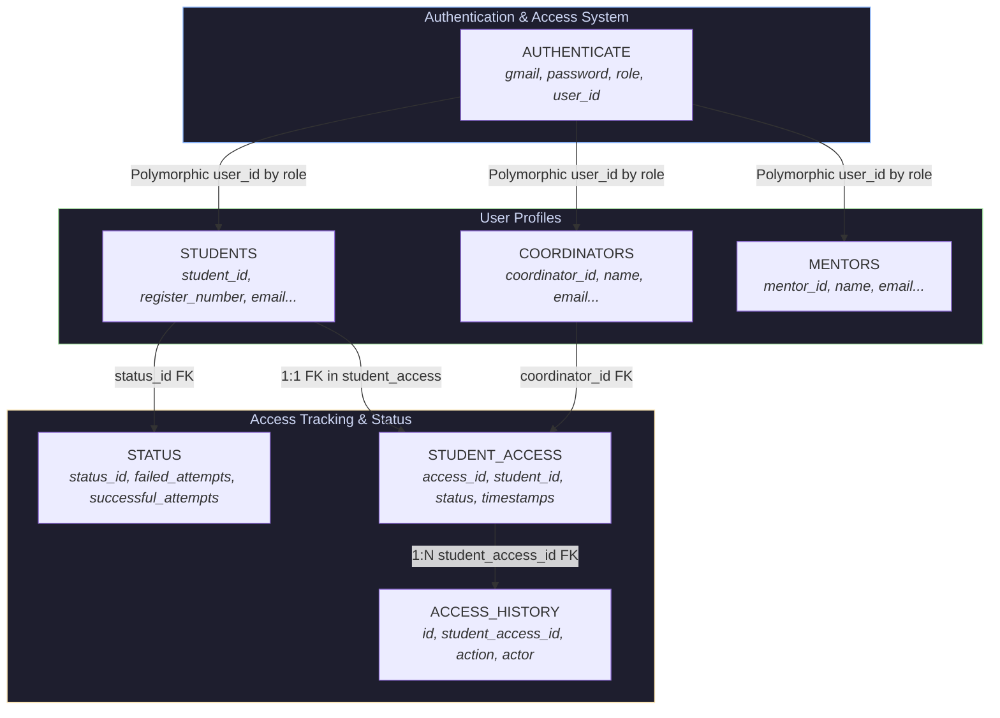
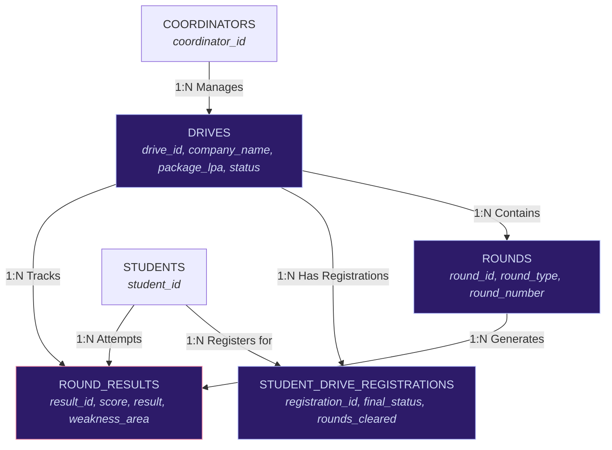
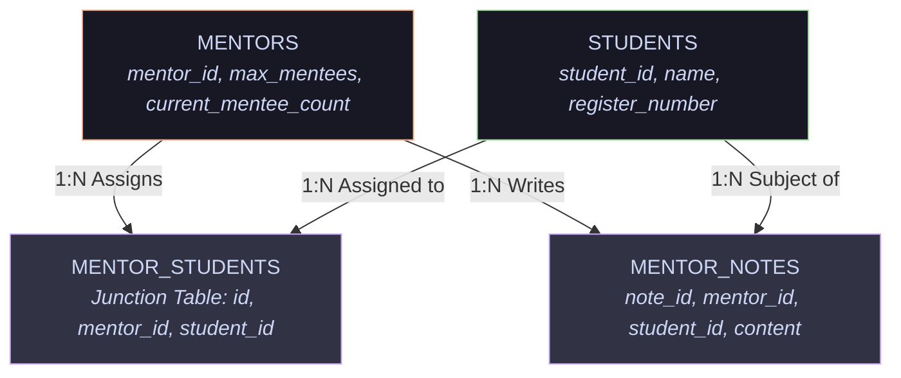
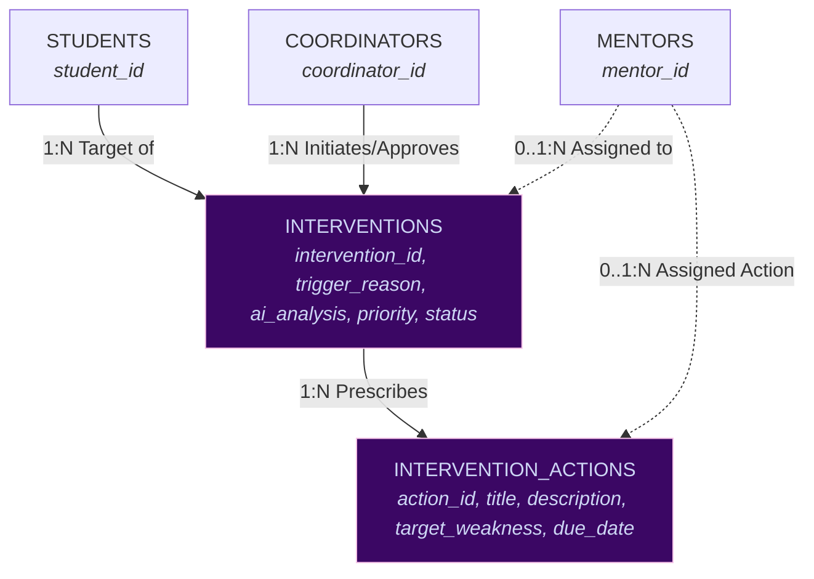
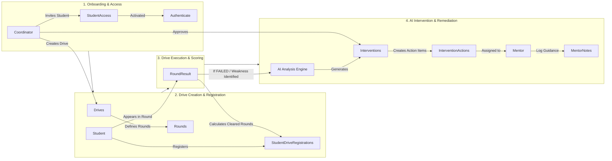

# Database Structure & Entity Relationship Flowchart

This document provides a comprehensive visual and textual guide to the database architecture for the **Placement & Interview Performance Tracking System**.

---

## 1. Complete Entity-Relationship (ER) Diagram

The diagram below illustrates all 15 database tables, their primary keys (`PK`), foreign keys (`FK`), unique keys (`UK`), and their cardinalities.

---

## 2. Module Breakdown Flowcharts

### Module A: User Identity & Access Management Flowchart

This subsystem handles role-based credentials (`AUTHENTICATE`), student profiles (`STUDENTS`), coordinator profiles (`COORDINATORS`), and invitation/access history (`STUDENT_ACCESS`, `ACCESS_HISTORY`).

---

### Module B: Placement Drives & Round Evaluation Flowchart

This subsystem tracks placement companies (`DRIVES`), interview rounds (`ROUNDS`), student registrations (`STUDENT_DRIVE_REGISTRATIONS`), and individual round outcomes (`ROUND_RESULTS`).

---

### Module C: Mentorship System Flowchart

Connects students with assigned mentors (`MENTOR_STUDENTS`) and allows mentors to log performance feedback (`MENTOR_NOTES`).

---

### Module D: AI Interventions & Remedial Action Flowchart

When students perform poorly in recruitment drives, the system triggers an AI intervention (`INTERVENTIONS`), reviewed by coordinators/mentors, which creates actionable task items (`INTERVENTION_ACTIONS`).

---

## 3. Data Flow & Inter-System Workflow

The flowchart below traces data movement across all system workflows: student registration -> drive execution -> round scoring -> AI intervention trigger -> mentor intervention action execution.

---

## 4. Comprehensive Schema Dictionary

| Table Name | Primary Key | Foreign Keys | Key Columns | Purpose |
| :--- | :--- | :--- | :--- | :--- |
| **`students`** | `student_id` | `status_id` -> `status.status_id` | `register_number`, `email`, `cgpa`, `tenth_percentage`, `twelfth_percentage`, `skills` | Stores core academic & contact profile for placement candidates. |
| **`coordinators`** | `coordinator_id` | None | `name`, `email`, `department` | Placement officer / department coordinator accounts. |
| **`mentors`** | `mentor_id` | None | `name`, `email`, `specialization`, `max_mentees`, `current_mentee_count` | Faculty / industry mentors assisting low-performing students. |
| **`status`** | `status_id` | None | `failed_attempts` (JSON), `successful_attempts` (JSON) | Summarizes student interview outcomes and history aggregations. |
| **`student_access`** | `access_id` | `student_id` -> `students.student_id`, `coordinator_id` -> `coordinators.coordinator_id` | `status` (`NO_ACCESS`, `INVITED`, `ACTIVE`, `REVOKED`), `invitation_sent_at`, `activated_at` | Controls portal access permissions for students. |
| **`access_history`** | `id` | `student_access_id` -> `student_access.access_id` | `action`, `actor`, `timestamp` | Audit log of access state changes (invitations, activations, revocations). |
| **`drives`** | `drive_id` | `coordinator_id` -> `coordinators.coordinator_id` | `company_name`, `company_type`, `package_lpa`, `required_cgpa`, `drive_status` | Recruitment drive hosted by hiring companies. |
| **`rounds`** | `round_id` | `drive_id` -> `drives.drive_id` | `round_type`, `round_number`, `round_name`, `total_appeared`, `total_passed` | Individual selection stage within a placement drive. |
| **`round_results`** | `result_id` | `student_id` -> `students.student_id`, `round_id` -> `rounds.round_id`, `drive_id` -> `drives.drive_id` | `result` (`PASSED`, `FAILED`), `score`, `weakness_area`, `feedback` | Outcome of a specific student in a specific drive round. |
| **`student_drive_registrations`** | `registration_id` | `student_id` -> `students.student_id`, `drive_id` -> `drives.drive_id` | `final_status`, `rounds_cleared`, `registered_at` | Student enrollment record for a company drive. |
| **`mentor_students`** | `id` | `mentor_id` -> `mentors.mentor_id`, `student_id` -> `students.student_id` | `assigned_at` | Junction table mapping mentor-to-student assignments. |
| **`mentor_notes`** | `note_id` | `mentor_id` -> `mentors.mentor_id`, `student_id` -> `students.student_id` | `content`, `created_at`, `updated_at` | Qualitative feedback and interaction notes written by mentors. |
| **`interventions`** | `intervention_id` | `student_id` -> `students.student_id`, `coordinator_id` -> `coordinators.coordinator_id`, `mentor_id` -> `mentors.mentor_id` | `trigger_reason`, `failure_summary`, `ai_analysis`, `priority`, `status` | System or AI generated intervention case for struggling students. |
| **`intervention_actions`** | `action_id` | `intervention_id` -> `interventions.intervention_id`, `assigned_to` -> `mentors.mentor_id` | `title`, `description`, `target_weakness`, `is_completed`, `due_date` | Prescribed remedial tasks assigned to resolve identified skill gaps. |
| **`authenticate`** | `gmail` | `user_id` (Polymorphic FK) | `password`, `user_id`, `role`, `is_active` | Central authentication store for logins across all roles. |

---

## 5. Enumeration Types Reference

| Enum Name | Defined Values | Usage Location |
| :--- | :--- | :--- |
| **`CompanyType`** | `PRODUCT`, `SERVICE`, `STARTUP`, `CONSULTING` | `drives.company_type` |
| **`DriveStatus`** | `UPCOMING`, `ONGOING`, `COMPLETED`, `CANCELLED` | `drives.drive_status` |
| **`RoundType`** | `APTITUDE`, `CODING`, `TECHNICAL`, `MANAGERIAL`, `HR`, `GROUP_DISCUSSION` | `rounds.round_type` |
| **`Result`** | `PASSED`, `FAILED` | `round_results.result` |
| **`Priority`** | `CRITICAL`, `HIGH`, `MEDIUM`, `LOW` | `interventions.priority` |
| **`InterventionStatus`** | `GENERATED`, `PENDING_REVIEW`, `APPROVED`, `IN_PROGRESS`, `COMPLETED`, `DISMISSED` | `interventions.status` |
| **`AccessStatus`** | `NO_ACCESS`, `INVITED`, `ACTIVE`, `REVOKED` | `student_access.status` |

---

## 6. Relationship Summary & Cardinality Rules

1. **Student to Status (`1 : 0..1`)**: A student may reference a `status` record containing aggregated success/failure history.
2. **Student to StudentAccess (`1 : 1`)**: Each student has exactly one access record enforcing portal permission state.
3. **Student to RoundResults (`1 : N`)**: A student can participate in multiple drive rounds, producing multiple `round_results`.
4. **Drive to Rounds (`1 : N`)**: Each placement drive contains one or more ordered recruitment `rounds`.
5. **Drive to StudentDriveRegistrations (`1 : N`)**: Multiple students register for a single drive.
6. **Mentor to Student (`N : M`)**: Managed via `mentor_students` junction table, mapping mentors to assigned mentees.
7. **Intervention to InterventionAction (`1 : N`)**: An intervention case breaks down into multiple prescribed action items.
